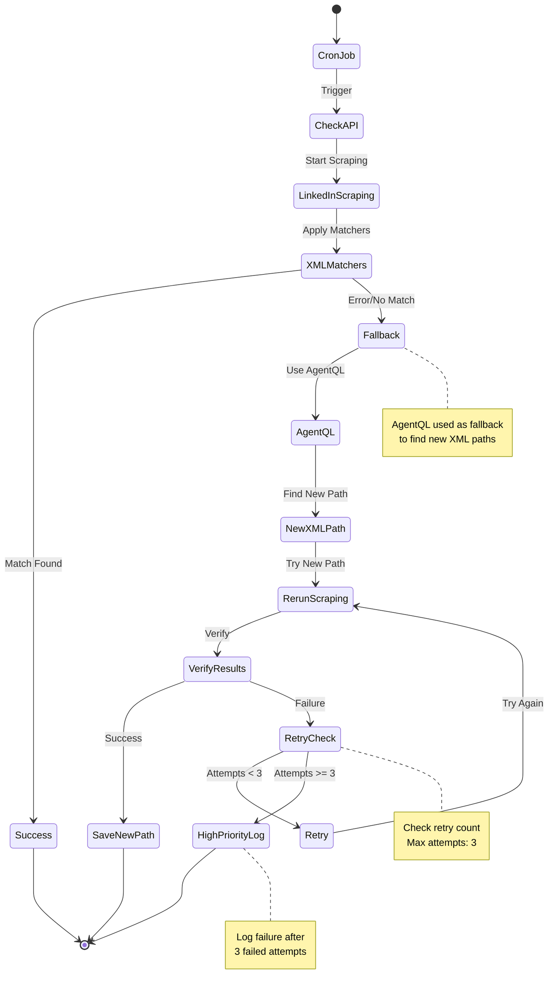

#### Testing

**Full creation sequence:**
`curl -X POST http://localhost:3000/api/instagram/register -H "Content-Type: application/json"`

##### Create a new email:
`curl -X POST http://localhost:3000/api/mail/create -H "Content-Type: application/json"`

##### Get the latest code given an email Md5 hash
`curl -X GET "http://localhost:3000/api/mail/messages/<hash>"`

curl -X GET "http://localhost:3000/api/mail/code/7d34dcac2824ea43235ccc884fbeae13"
##### Get new set of working proxies:

http://185.206.71.91:9090 -> worked

{"id":"bb32b8b30906d7018958ea75537627ef","from":"\"Instagram\" <security@mail.instagram.com>","subject":"Verify your account","timestamp":1732659380.242,"verificationCode":null},{"id":"42d44ff31136f9114b42fc46537496a7","from":"\"Instagram\" <security@mail.instagram.com>","subject":"Verify your account","timestamp":1732659565.548,"verificationCode":null}

info: Filling form with data: {
  "email": "manish.winhold.b2f819af@tgvis.com",
  "emailHash": "7d34dcac2824ea43235ccc884fbeae13",
  "username": "manish.winhold.b2f819af_9445",
  "fullName": "nthenya karen",
  "password": "d69dd05a5c541b2f!1A",
  "birthday": {
    "year": 1992,
    "month": 3,
    "day":

`npm run findProxies`  

```js
Found proxies: [
  { server: 'http://185.206.71.91:9090', type: 'http', isKnown: false },
  { server: 'http://47.238.128.246:100', type: 'http', isKnown: false },
  { server: 'http://8.219.97.248:80', type: 'http', isKnown: false },
  { server: 'http://204.57.112.5:80', type: 'http', isKnown: false },
  { server: 'http://47.119.164.33:8080', type: 'http', isKnown: false },
  { server: 'http://8.221.139.222:8008', type: 'http', isKnown: false },
  { server: 'http://44.195.247.145:80', type: 'http', isKnown: false },
  { server: 'http://39.102.208.23:8081', type: 'http', isKnown: false },
  { server: 'http://157.254.53.50:80', type: 'http', isKnown: false },
  { server: 'http://8.220.205.172:9098', type: 'http', isKnown: false }
]
```

### Blocker:
+ Accounts are being suspended upon creation
  + implemented proxies and rotation
  + make changes to the interactions
  + ip? -> might be blacklisted
    + look into ip rotation
  + maybe is the email domain?

_if more than half a day -> manually create and move to interactions_


## Changes, plan, status, notes:

+ modify data schema
  - [ ] user -> many accounts -> session & many-msgs

+ create instagram account
  - AgentQL routes ig
  - [x] email creation service
  - [x] verification code handling
  - [ ] account creation UI
    - [ ] x numbers of accounts
    - [ ] call API route to perform tasks bulk (realtime updates -> later)
  - perform login on all accounts and save credentials

  + account management 
  - status API 
  - select owned accounts
  + Comments
    + input text
    + OpenAI call
    + parse and show responses
  - API route actions
    - accounts, like/reply
    - like API: load session and like agentQL
    - comment API: load session and input text
  + log all (check data schema)
+ logs page
  + TODO


### Completed:

+ [X] remove ig login as entry -> standard username/password
  - [X] add google oauth 
    - [x] passport dep
    - [x] create google vars
    - [x] update user model 
    - [x] update backend
    - [x] test login for main app
    - [X] update front end

+ [X] AgentQL Instagram creation
  - [X] Instagram service add register
  - [X] test workflow
  - [X] get and use custom email
  - [X] fill in all other fields
  - [X] choose birthday and submit
    - ! requery elements and click submit
  - [X] wait 5 sec
    - [X] extract code from temp email
    - [X] input code and wait

  - [ ] save credentials


**using [Temp-mail API](https://temp-mail.org/en/api)**
+ Free tier: 100 req/day
+ Pro tier: $19/mo 5000 req/day
+ [Pricing] https://rapidapi.com/Privatix/api/temp-mail/pricing


### Product Design Document

Product Overview
The Instagram Influence Machine is a web +based application designed to

- create
- manage
- automate actions (like, comment, reply)
  > using multiple Instagram accounts

Users can select multiple accounts to perform mass actions on specific Instagram comment URLs.

Additionally, it allows for

- automatic account creation
- logs activity
- provides reply variations (AI).

#### Specifications

General Features

1.  Platform: Web Application
2.  Maximum Accounts: Up to 100 accounts for initial version
3.  Default Delay: 20 seconds between actions (adjustable in the UI)
4.  Generative AI: Utilized for paraphrasing replies.

### Tabs and UI Flow

#### Account Management Tab

**Purpose**: Add, manage, and monitor Instagram accounts.

Components:

- Account List:
  - Displays all added accounts in a table.
- Columns:
  - Instagram Username
  - Status (Active/Expired Cookies)
  - Checkbox for selection
  - Expired cookies indicated with a clear marker (e.g., red text).

* Actions:
  - Checkbox to select accounts for actions (like, comment, reply).
  - Numerical control to set delay between actions (default: 20 seconds).
  - Mass Perform Button:
  - Executes selected action on the chosen accounts using stored cookies.
  - Options:
    - Like: Requires Instagram comment URL.
    - Reply: Requires Instagram comment URL and sample reply text. Generates variations and previews them.
  - Account Creation:
    - Button to navigate to the “Create Accounts” tab.

#### Account Creation Tab

• **Purpose**: Automatically create new Instagram accounts.
Components:

- Number of Accounts:
  - Numerical input control to specify the number of accounts to create (1–20).
- Create Button:
  - Triggers automatic account creation and adds them to the account list in the "Account Management" tab.
- Status Indicator:
  - Real +time feedback on account creation progress (e.g., “3/10 accounts created”).

#### Action Logs Tab

**Purpose**: Display a log of all actions performed by the system.
Components:

- Log Table:
- Columns:
  - Timestamp
  - Action Type (Like/Reply)
  - Account Username
  - Status (Success/Failure)
  - URL (for likes/comments)
  - Reply Variation (if applicable)
  - Filter Options (Future Enhancement):
  - Filter logs by action type, account, or status.
- Export Logs:
  - Button to export logs as a CSV file for reporting (optional).

### Core Functionalities

#### 1. Action Execution:

- Use stored cookies for Instagram accounts.
- Perform the selected action (like, comment, reply) on the provided Instagram comment URL.
- Automatic delay between actions (default 20 seconds; customizable).
- Preview next reply variation generated by AI before posting.

#### 2. Generative AI Integration:

- Reply variations generated by AI (e.g., OpenAI, Hugging Face, etc.).
- Display preview of AI +generated variation before posting.

#### 3. Account Creation:

- Automates creation of up to 20 Instagram accounts at a time.
- Adds new accounts to the account list automatically.

#### 4. Cookie Expiry Management:

- Detect and flag expired cookies in the "Account Management" tab.
- Allow users to reauthenticate manually or delete accounts with expired cookies.

#### 5. Logging:

- Log all performed actions (successful or failed).
- Include timestamp, action type, accounts used, and status in logs.

### Technical Requirements

#### 1. Front +End:

- Framework: React.js or similar.
- Responsive UI for easy usability.

#### 2. Back +End:

- Framework: Node.js with Express.
- Database: MongoDB or PostgreSQL for storing accounts, cookies, logs, and settings.
- Authentication: OAuth for account login and cookie retrieval.

#### 3. Generative AI:

- Integrate with an API (e.g.
  , OpenAI GPT) for generating reply variations.

#### 4. Automation:

- AgentQL

#### 5.Security:

- Encrypt stored cookies and account details.
- Use rate +limiting to avoid detection or bans from Instagram.

### Future Enhancements

#### 1. Advanced Account Filtering:

- Add search and filter options for accounts in the "Account Management" tab.

#### 2. Action Metrics Dashboard:

- Visual analytics for actions performed, success rate, etc.

#### 3. Additional Actions:

- Support for follow/unfollow, post liking, and direct messaging.


### idea for check and AgentQL Integration


