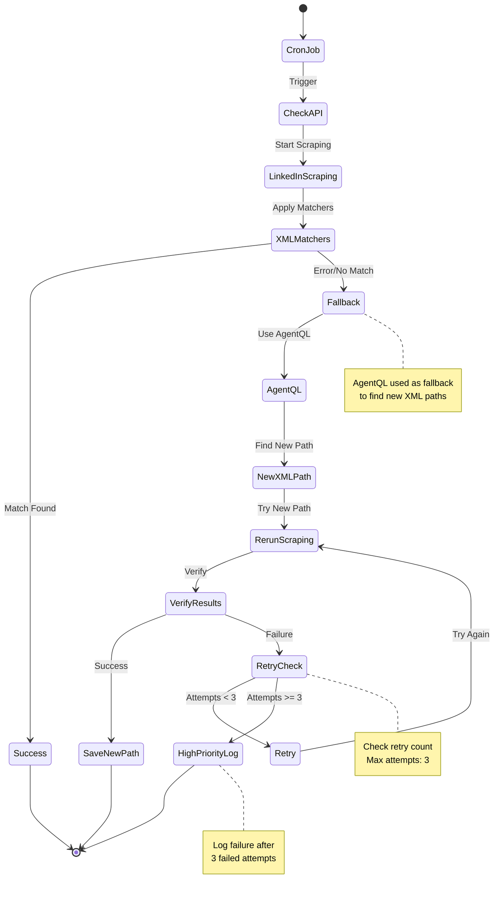

#### Testing

username creation file:

backend/src/core/mail/temp-mail.service.js

**429 error**
cat ~/.config/adspower_global/cwd_global/source/local_api/
http://local.adspower.com:50325/status

```
{
    "message": "feedback_required",
    "spam": true,
    "feedback_title": "Try Again Later",
    "feedback_message": "We limit how often you can do certain things on Instagram to protect our community. Tell us if you think we made a mistake.",
    "feedback_url": "repute/report_problem/scraping/",
    "feedback_appeal_label": "Let us know",
    "feedback_ignore_label": "OK",
    "feedback_action": "report_problem",
    "status": "fail"
}
```

> no longer accesible via CLI must use front-end

**Full creation sequence:**
`curl -X POST http://localhost:3000/api/v1/instagram/register  `

##### Create a new email:
`curl -X POST http://localhost:3000/api/v1/mail/generate"`

##### Get the latest code given an email Md5 hash
`curl -X GET "http://localhost:3000/api/mail/messages/<hash>"`

curl http://localhost:3000/api/v1/mail/code/d5afc285a93854ed61858b82ac0644bd
##### Get new set of working proxies:


Device
Do not launch multiple accounts on the same device, as this increases the risk of them being linked and banned. You must use specialized software to spoof fingerprints and make each account appear as if it is using a different device. 1 account - 1 device.


Anti-detect Browser
If you plan to use accounts manually, don’t log in to accounts from regular browsers such as Brave, Opera, Firefox, Chrome, etc. Use anti-detect browsers like Multilogin, AdsPower, or similar tools. For Telegram accounts, you must purchase specific software, as regular browsers do not work with them.


### Blocker:
+ [X] Accounts are being suspended upon creation
  + implemented proxies and rotation
  + make changes to the interactions
  + ip? -> might be blacklisted
    + look into ip rotation
  **Solved by AdPower Browser**
+ 429
  + proxies do not work
  + wait time? one account per proxy?

## Changes, plan, status, notes:

  - perform login on all accounts and save credentials
  + Comments
    + input text
    + OpenAI call
    + parse and show responses
  - API route actions
    - accounts, like/reply
    - like API: load session and like agentQL
    - comment API: load session and input text
  + log all (check data schema)
+ logs page
  + TODO


### Completed:

+ [X] remove ig login as entry -> standard username/password
  - [X] add google oauth 
    - [x] passport dep
    - [x] create google vars
    - [x] update user model 
    - [x] update backend
    - [x] test login for main app
    - [X] update front end

+ [X] AgentQL Instagram creation
  - [X] Instagram service add register
  - [X] test workflow
  - [X] get and use custom email
  - [X] fill in all other fields
  - [X] choose birthday and submit
    - ! requery elements and click submit
  - [X] wait 5 sec
    - [X] extract code from temp email
    - [X] input code and wait

+ create instagram account
  - AgentQL routes ig
  - [x] email creation service
  - [x] verification code handling
  - [X] account creation UI
    - [X] x numbers of accounts
    - [X] call API route to perform tasks bulk (realtime updates -> later)
  - [X] save credentials

    + account management 
  - [X] status API 
  - [X] select owned accounts

  + modify data schema
  - [X] user -> many accounts -> session & many-msgs


**using [Temp-mail API](https://temp-mail.org/en/api)**
+ Free tier: 100 req/day
+ Pro tier: $19/mo 5000 req/day
+ [Pricing] https://rapidapi.com/Privatix/api/temp-mail/pricing


### Product Design Document

Product Overview
The Instagram Influence Machine is a web +based application designed to

- create
- manage
- automate actions (like, comment, reply)
  > using multiple Instagram accounts

Users can select multiple accounts to perform mass actions on specific Instagram comment URLs.

Additionally, it allows for

- automatic account creation
- logs activity
- provides reply variations (AI).

#### Specifications

General Features

1.  Platform: Web Application
2.  Maximum Accounts: Up to 100 accounts for initial version
3.  Default Delay: 20 seconds between actions (adjustable in the UI)
4.  Generative AI: Utilized for paraphrasing replies.

### Tabs and UI Flow

#### Account Management Tab

**Purpose**: Add, manage, and monitor Instagram accounts.

Components:

- Account List:
  - Displays all added accounts in a table.
- Columns:
  - Instagram Username
  - Status (Active/Expired Cookies)
  - Checkbox for selection
  - Expired cookies indicated with a clear marker (e.g., red text).

* Actions:
  - Checkbox to select accounts for actions (like, comment, reply).
  - Numerical control to set delay between actions (default: 20 seconds).
  - Mass Perform Button:
  - Executes selected action on the chosen accounts using stored cookies.
  - Options:
    - Like: Requires Instagram comment URL.
    - Reply: Requires Instagram comment URL and sample reply text. Generates variations and previews them.
  - Account Creation:
    - Button to navigate to the “Create Accounts” tab.

#### Account Creation Tab

• **Purpose**: Automatically create new Instagram accounts.
Components:

- Number of Accounts:
  - Numerical input control to specify the number of accounts to create (1–20).
- Create Button:
  - Triggers automatic account creation and adds them to the account list in the "Account Management" tab.
- Status Indicator:
  - Real +time feedback on account creation progress (e.g., “3/10 accounts created”).

#### Action Logs Tab

**Purpose**: Display a log of all actions performed by the system.
Components:

- Log Table:
- Columns:
  - Timestamp
  - Action Type (Like/Reply)
  - Account Username
  - Status (Success/Failure)
  - URL (for likes/comments)
  - Reply Variation (if applicable)
  - Filter Options (Future Enhancement):
  - Filter logs by action type, account, or status.
- Export Logs:
  - Button to export logs as a CSV file for reporting (optional).

### Core Functionalities

#### 1. Action Execution:

- Use stored cookies for Instagram accounts.
- Perform the selected action (like, comment, reply) on the provided Instagram comment URL.
- Automatic delay between actions (default 20 seconds; customizable).
- Preview next reply variation generated by AI before posting.

#### 2. Generative AI Integration:

- Reply variations generated by AI (e.g., OpenAI, Hugging Face, etc.).
- Display preview of AI +generated variation before posting.

#### 3. Account Creation:

- Automates creation of up to 20 Instagram accounts at a time.
- Adds new accounts to the account list automatically.

#### 4. Cookie Expiry Management:

- Detect and flag expired cookies in the "Account Management" tab.
- Allow users to reauthenticate manually or delete accounts with expired cookies.

#### 5. Logging:

- Log all performed actions (successful or failed).
- Include timestamp, action type, accounts used, and status in logs.

### Technical Requirements

#### 1. Front +End:

- Framework: React.js or similar.
- Responsive UI for easy usability.

#### 2. Back +End:

- Framework: Node.js with Express.
- Database: MongoDB or PostgreSQL for storing accounts, cookies, logs, and settings.
- Authentication: OAuth for account login and cookie retrieval.

#### 3. Generative AI:

- Integrate with an API (e.g.
  , OpenAI GPT) for generating reply variations.

#### 4. Automation:

- AgentQL

#### 5.Security:

- Encrypt stored cookies and account details.
- Use rate +limiting to avoid detection or bans from Instagram.

### Future Enhancements

#### 1. Advanced Account Filtering:

- Add search and filter options for accounts in the "Account Management" tab.

#### 2. Action Metrics Dashboard:

- Visual analytics for actions performed, success rate, etc.

#### 3. Additional Actions:

- Support for follow/unfollow, post liking, and direct messaging.


`npm run findProxies`  

```js
Found proxies: [
  { server: 'http://185.206.71.91:9090', type: 'http', isKnown: false },
  { server: 'http://47.238.128.246:100', type: 'http', isKnown: false },
  { server: 'http://8.219.97.248:80', type: 'http', isKnown: false },
  { server: 'http://204.57.112.5:80', type: 'http', isKnown: false },
  { server: 'http://47.119.164.33:8080', type: 'http', isKnown: false },
  { server: 'http://8.221.139.222:8008', type: 'http', isKnown: false },
  { server: 'http://44.195.247.145:80', type: 'http', isKnown: false },
  { server: 'http://39.102.208.23:8081', type: 'http', isKnown: false },
  { server: 'http://157.254.53.50:80', type: 'http', isKnown: false },
  { server: 'http://8.220.205.172:9098', type: 'http', isKnown: false }
]
```


### idea for check and AgentQL Integration



### Technical Architecture

#### Backend Components

1. **Container Management**
   - Uses AdsPower browser containers for isolated Instagram sessions
   - Each account runs in a separate container to prevent fingerprinting
   - Container lifecycle managed through AdsPower's local API (port 50325)

2. **Service Layer**
   - Instagram Service: Handles account creation, login, and actions
   - Mail Service: Manages temporary email generation and verification codes
   - Browser Service: Controls AdsPower browser instances and sessions
   - Proxy Service: Manages proxy rotation and validation

3. **Browser Automation**
   - AgentQL for reliable element selection and interaction
   - Automated workflows for account creation and actions
   - Built-in delays and randomization to avoid detection

4. **Configuration**
   - Environment-based config for services
   - Proxy settings and rotation rules
   - Rate limiting and delay settings
   - Browser profiles and fingerprinting settings

5. **Data Persistence**
   - Account credentials and session data
   - Container IDs and browser profiles
   - Action logs and status tracking
   - Proxy lists and performance metrics

#### Key Integration Points

- AdsPower Local API: `http://local.adspower.com:50325`
- Temp Mail API for email verification
- OpenAI API for comment generation
- Proxy validation endpoints

#### Security Measures

- One account per container policy
- Proxy rotation for IP diversity
- Fingerprint spoofing via AdsPower
- Rate limiting and action delays
- Encrypted credential storage
