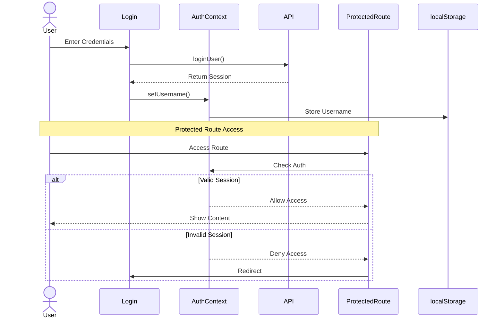
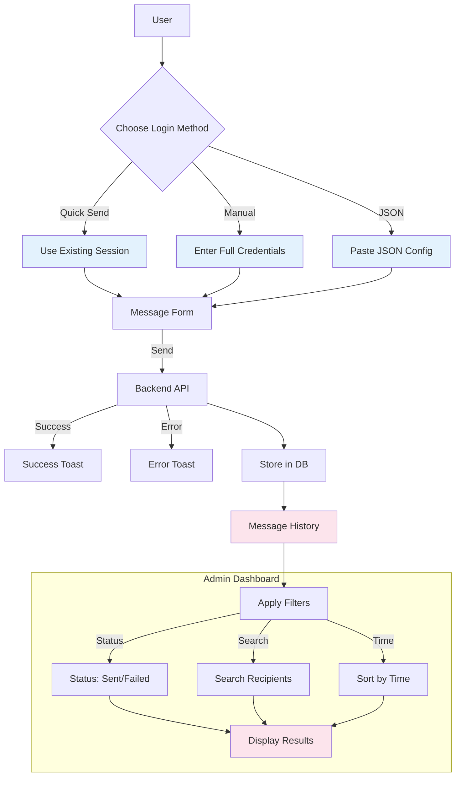

# Developer-Assessment-Test-Instagram-Messaging-Interface

_By Juan Gomez, and some neural network that knows too much_

See original master plans:
[Backend 70% time](backend/development_plan.md)
[Frontend 30% time](frontend/development_plan.md)

# Instagram Messenger Frontend

React application for Instagram message automation with TypeScript and shadcn/ui.

## Features

- Session-based authentication with protected routes
- Three message sending modes:
  - Quick Send: Session-based
  - Manual Input: Full credentials
  - API-Based: JSON payload
- Admin dashboard with:
  - Message history tracking
  - Status filtering
  - Recipient search
  - Real-time updates

## Setup

```bash
npm install
npm run dev
```
*_backend must be running on port 3000_
## Tech Stack

- React 18 with TypeScript
- React Router v6
- Axios for API calls
- TailwindCSS & shadcn/ui
- React Hook Form + Zod validation
- Sonner for toasts

## Project Structure

```
src/
├── components/      # UI components
├── contexts/        # Auth context
├── lib/             # API and types
```

#### Routes
- `/login`: Authentication
- `/messages`: Message form
- `/admin`: Message history dashboard

### Authentication Flow



### Message Operations Flow


# Instagram Messenger Backend

A Node.js backend service that handles automated Instagram messaging using Playwright (agentql) for browser automation.

## Features

- Instagram session management with MongoDB
- Automated login and message sending
- Session persistence and reuse
- Message history tracking
- Error handling and logging
- Screenshot capture for debugging
- API endpoints for message operations

## Requirements

- Node.js 16+
- MongoDB
- AgentQL API key

## Setup

1. Install dependencies:
```bash
npm install
```

2. Create `.env` file:
```env
PORT=3000
MONGODB_URI=your_mongodb_uri
AGENTQL_API_KEY=your_agentql_key
NODE_ENV=production
```

3. Start the server:
```bash
npm start
```

## API Endpoints

- `POST /api/login`: Login to Instagram
- `POST /api/login/force`: Force new login session
- `POST /api/messages/send`: Send message using existing session
- `POST /api/messages/send-with-auth`: Send message with authentication
- `GET /api/messages/history/:username`: Get message history

## Project Structure

```
src/
├── config/          # Configuration files
├── models/          # Database models
├── services/        # Business logic
└── utils/           # Helper functions
```

### Technical diagram


## Session Service

### Core Functionality

The SessionService manages Instagram sessions and user authentication:

```javascript
// Create/Update session
await sessionService.createOrUpdateSession(username, password, sessionData);

// Validate existing session
const isValid = await sessionService.validateSession(username);

// Get stored credentials
const credentials = await sessionService.getStoredCredentials(username);

// Log message activity
await sessionService.logMessage(fromUser, toUser, content, status);

// Get message history
const history = await sessionService.getMessageHistory(username, {
  status: 'sent',
  recipient: 'user123'
});
```

### Session Management

- **Session Storage**: Stores essential Instagram cookies (sessionId, userId, csrfToken, rur)
- **Password Security**: Implements bcrypt hashing for stored passwords
- **Expiration**: Sessions automatically expire after 24 hours
- **Message Tracking**: Logs all message attempts with status and errors


### Data Schema

```javascript
{
  instagram_username: String,
  instagram_password: String, // Hashed
  session: {
    sessionId: String,
    userId: String,
    csrfToken: String,
    rur: String,
    expiresAt: Date
  },
  messages: [{
    recipient: String,
    content: String,
    status: String,
    createdAt: Date,
    error: String
  }],
  lastActivity: Date
}
```